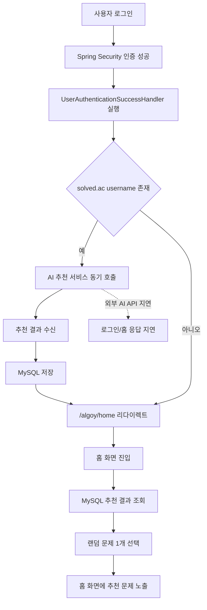
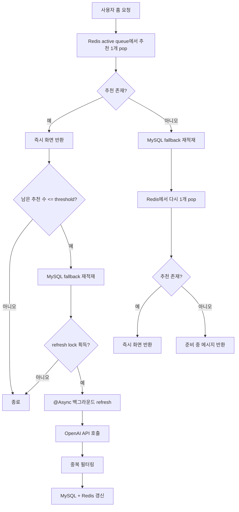

# Algoy README 초안

## 프로젝트 소개

Algoy는 알고리즘 학습과 문제 추천을 지원하는 웹 서비스입니다. 사용자는 코딩 테스트 문제 제공 외부 API 기반 정보와 외부 AI API를 연동해 문제를 추천받고, 학습 기록을 관리할 수 있습니다.

저는 해당 프로젝트에서 AI 문제 추천 기능과 성능 개선 및 운영 환경 구성을 담당했습니다.                                                                                                               
1차 개발에서는 웹 서비스와 AI 추천 서비스를 분리해 장애 영향을 격리하는 구조를 설계했고,
추천 기능의 기본 동작 흐름을 구현 했습니다.
2차 개발에서는 Redis와 비동기를 도입해 추천 조회 경로와 추천 생성 경로를 분리했습니다.                        
또한 CI/CD 배포 자동화, Nginx 설정, 서버 환경 구축까지 함께 맡아 기능 개선부터 인프라 구축을 수행하였습니다.

- 프로젝트 기간: 1차 2024.08.19 - 2024.09.12 / 2차 2026.04.03 - 2026.04.23
- 진행 형태: 6인 팀 프로젝트
- 담당 영역:
    - AI 문제 추천 기능 구현
    - AI 추천 서비스 분리 아키텍처 설계
    - Redis 기반 추천 queue / set / lock 구조 설계
    - 비동기 refresh 처리 및 성능 개선
    - CI/CD 배포 자동화
    - Nginx 설정 및 서버 환경 구축


## As-Is (1차 개발)

1차 개발에서는 로그인 성공 직후 웹 애플리케이션이 AI 추천 애플리케이션을 동기 호출해 추천 결과를 생성하고, 이를 MySQL에 저장한 뒤 홈 화면에서 다시 조회하는 구조였습니다.

- AI API 호출이 로그인 요청과 같은 경로에서 수행되었습니다.
- 홈 화면은 MySQL에 저장된 추천 결과를 조회해 랜덤 문제 1개를 노출했습니다.
- 따라서 외부 AI API 지연이 로그인 및 홈 응답 시간에 직접 영향을 주는 구조였습니다.

### 플로우 차트(As-Is)

<details>
<summary>As-Is 플로우 차트 보기</summary>



</details>


## 문제 상황

1차 구조에서는 AI API 호출이 요청 스레드 안에서 동기적으로 수행되었습니다.

- 로그인 성공 시점에 AI API 호출 로직이 직접 호출되었습니다.
- 홈 진입 시 외부 AI API 응답을 사용자 요청 스레드가 그대로 기다려야 했습니다.
- 결과적으로 렌더링이나 DB 조회보다 **외부 AI API I/O 지연이 로그인/홈 응답 시간에 직접 전파**되는 구조였습니다.

로그 기준으로도 이 병목은 명확했습니다.

- 로그인 경로는 평균 8.3초였고, 그 지연의 대부분이 AI 호출 대기 시간(평균 8.286초)이었습니다.
- 전체 OpenAI 호출은 최대 14.299초까지 증가해, 느린 외부 I/O가 요청 경로 병목의 핵심임을 확인했습니다.

즉, 문제의 본질은 느린 외부 API 호출이 사용자 요청 경로 안에서 동기적으로 수행되고 있었다는 점이었습니다.


## To-Be (2차 개발)

- 목표: 외부 AI API 지연이 사용자 요청 경로에 직접 전파되지 않도록 추천 조회 경로와 추천 생성 경로를 분리
- 핵심 전략: Redis 기반 fast path + `@Async` 기반 백그라운드 refresh

1. Redis 도입
- `Redis` : 추천 문제 상태를 관리하는 저장소로 사용
- `MySQL fallback`: Redis 데이터가 부족할 때 마지막 추천 세트를 다시 적재해 화면 공백 최소화
- `active queue`: AI API 호출로 받아온 추천 문제를 적재하고, 홈 요청 시 데이터를 우선 조회해 즉시 반환하는 저장소로 사용
- `seen set`: 이미 사용자에게 노출한 문제를 기록해 중복 추천 방지
- `refresh lock`: 동일 사용자에 대한 중복 추천 및 DB 갱신 실행 방지

2. 비동기 처리
- 홈 요청에서는 추천 갱신 필요 여부만 판단
- OpenAI 호출과 추천 데이터 갱신은 `@Async` 기반 백그라운드 작업으로 분리
- 사용자 응답은 먼저 반환하고, 추천 생성은 뒤에서 처리하도록 구조 변경
- 외부 AI API 지연이 홈 응답 시간에 직접 전파되지 않도록 개선


### 플로우 차트(To-Be)

<details>
<summary>To-Be 플로우 차트 보기</summary>



</details>


## 성과

- 추천 문제를 노출하는 홈 응답이 평균 6749.3ms에서 21.4ms로 줄었다
- 외부 AI API 호출을 비동기 처리로 분리해, 느린 외부 호출이 홈 응답 시간에 직접 전파되지 않도록 개선했다.
- Redis 기반 문제 추천 구조를 적용해 추천 상태를 관리하고 중복 추천을 관리했다.

### Before / After 성능 로그 비교


| 항목        | Before avg | After avg | 해석                                    |
|-----------| --- | --- |---------------------------------------|
| Home 호출   | `6749.3ms` | `21.4ms` | 문제 추천을 위한 외부 API 호출 상황에서도 홈 응답을 시간 단축 |
| 외부 AI API | `6733.2ms ` | `21702.5ms ` | 외부 API 자체는 빨라지지 않았지만, 요청 경로 영향은 제거    |


## 배운 점

이번 개선을 진행하면서 성능 문제는 단순히 Redis 같은 기술을 추가하는 것만으로 해결되지 않는다는 점을 배웠습니다.
처음에는 캐시를 도입하면 자연스럽게 빨라질 것이라고 생각했지만, 실제로는 외부 추천 API 대기가 요청 스레드 안에서 동기적으로 수행되는 구조 자체가 핵심 병목이었습니다.
그래서 먼저 로그를 통해 병목을 확인하고, 이후 추천 조회 경로와 추천 생성 경로를 분리하는 방향으로 구조를 다시 설계했습니다.

또한 Redis를 단순 조회 캐시가 아니라 추천 상태를 관리하는 저장소로 활용하면서, 사용자 경험이 개선된다는 점을 배웠습니다.
이번 작업을 통해 성능 개선은 병목 분석, 구조 변경, 그리고 로그 기반 검증까지 이어지는 과정이 더 중요하다는 점을 배웠습니다.


## 아키텍처 구조


## 프로젝트 구조

```plaintext                                                                                                                                                               
    src/main/java/com/example/algoyweb                                                                                                                                         
    ├─ config                                                                                                                                                                  
    │  ├─ async/AsyncConfig.java                                                                                                                                               
    │  ├─ redis/RedisConfig.java                                                                                                                                               
    │  └─ SecurityConfig.java                                                                                                                                                  
    ├─ controller                                                                                                                                                              
    │  ├─ HomeController.java                                                                                                                                                  
    │  └─ allen/AllenController.java                                                                                                                                           
    ├─ service                                                                                                                                                                 
    │  ├─ user/UserService.java                                                                                                                                                
    │  ├─ allen                                                                                                                                                                
    │  │  ├─ AllenService.java                                                                                                                                                 
    │  │  └─ HttpURLConnectionEx.java                                                                                                                                          
    │  ├─ openai                                                                                                                                                               
    │  │  ├─ OpenAIRecommendationService.java                                                                                                                                  
    │  │  ├─ RecommendationRefreshService.java                                                                                                                                 
    │  │  └─ RecommendationAsyncService.java                                                                                                                                   
    │  └─ redis                                                                                                                                                                
    │     └─ RecommendationRedisService.java                                                                                                                                   
    ├─ repository                                                                                                                                                              
    │  └─ allen/SolvedACResponseRepository.java                                                                                                                                
    ├─ model                                                                                                                                                                   
    │  ├─ dto                                                                                                                                                                  
    │  │  ├─ allen                                                                                                                                                             
    │  │  │  ├─ SolvedACResponseDto.java                                                                                                                                       
    │  │  │  └─ SolvedACJsonResponse.java                                                                                                                                      
    │  │  └─ openai                                                                                                                                                            
    │  │     └─ OpenAIRecommendationItem.java                                                                                                                                  
    │  └─ entity                                                                                                                                                               
    │     └─ allen                                                                                                                                                             
    │        └─ SolvedACResponseEntity.java                                                                                                                                    
    └─ util                                                                                                                                                                    
       └─ user/UserAuthenticationSuccessHandler.java 
```

## 데이터 구조

### Redis (Web 서버)

| Key Pattern | Type | Value | TTL | 역할                  |
| --- | --- | --- | --- |---------------------|
| `recommendation:active:{userEmail}` | List | 화면에 즉시 보여줄 추천 문제 목록 | 12시간 | 홈 요청 데이터 순차 노출      |
| `recommendation:seen:{userEmail}` | Set | 이미 추천 세트에 포함한 문제 번호 | 30일 | 중복 추천 방지            |
| `recommendation:refresh-lock:{userEmail}` | String | `"1"` | 2분 | 같은 사용자 중복 추천 문제 갱신 방지 |

### ERD (Web 서버)


### MongoDB (AI 서버)

| Collection | 주요 필드 | 역할 |
| --- | --- | --- |
| `problem_recommendations` | `_id`, `userId`, `recommendedProblems[]`, `createdAt`, `updatedAt` | OpenAI 추천 결과 저장 |
| `chat_messages` | `_id`, `content`, `responses[]`, `timestamp` | 챗봇 대화 메시지 저장 |
| `quiz_recommend` | `_id`, `userId`, `content`, `response`, `timeStamp` | 추천 질의/응답 기록 저장 |

 <details>                                                                                                                                                                         
  <summary><code>problem_recommendations</code> 문서 예시</summary>                                                                                                                 

  ```json                                                                                                                                                                           
  {                                                                                                                                                                                 
    "_id": "661f...",                                                                                                                                                               
    "userId": "zoanna5442@gmail.com",                                                                                                                                               
    "recommendedProblems": [                                                                                                                                                        
      {                                                                                                                                                                             
        "problemNo": "1000",                                                                                                                                                        
        "title": "A+B",                                                                                                                                                             
        "details": "기초 구현 문제"                                                                                                                                                 
      }                                                                                                                                                                             
    ],                                                                                                                                                                              
    "createdAt": "2026-04-23T18:00:00",                                                                                                                                             
    "updatedAt": "2026-04-23T18:00:00"                                                                                                                                              
  }                                                                                                                                                                                 
  </details>                                                                                                                                                                        
  ```       


## UI 설계

- Figma: [Algoy UI Design](https://www.figma.com/design/cFtdGffRUuFPeJqK6kcBUc/Algoy?node-id=0-1&node-type=canvas&t=jG8aeeZxixqGCodM-0)

## 담당 기술 스택

#### Backend
- `Java 17`
- `Spring Boot`
- `Spring Security`
- `JPA`

#### Database / Storage
- `Redis`
- `StringRedisTemplate`
- `MySQL`

#### API / Communication
- `REST API`
- `WebClient`

#### Async / Performance
- `Spring Async`
- `ThreadPoolTaskExecutor`

#### Infra / DevOps
- `Amazon EC2`
- `Amazon RDS`
- `Nginx`
- `GitHub Actions`
- `Docker`


