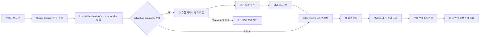
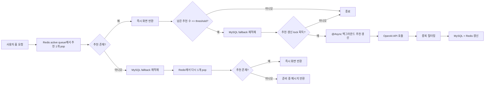

### 🔗 관련 레포지토리
- Algoy-Web Repository (Web Server): [https://github.com/high-five-algoy/Algoy-Web.git](링크)
- Algoy-AI Repository (AI Server): [https://github.com/high-five-algoy/Algoy-AI.git](링크)

## ✨프로젝트 소개 (Algoy-Web)

Algoy는 알고리즘 학습과 문제 추천을 지원하는 웹 서비스입니다. 사용자는 풀이 이력을 바탕으로 AI 추천을 받고, 학습 기록을 관리할 수 있습니다.

본 프로젝트는 1차 개발 이후 2차 개발을 거쳐 개선했습니다
 
1차 개발: 웹 서비스와 AI 추천 서비스를 분리해 장애 영향을 격리하는 구조를 설계했고,
        추천 기능의 기본 동작 흐름을 구현 했습니다.

2차 개발(개인 고도화): Redis와 비동기를 도입해 추천 조회 경로와 추천 생성 경로를 분리했습니다.

- 프로젝트 기간: 1차 2024.08.19 - 2024.09.12 / 2차(개인 고도화) 2026.04.03 - 2026.04.23
- 진행 형태: 6인 팀 프로젝트
- 담당 기능 구현:
    - AI 문제 추천 기능 구현
    - Redis 기반 추천 queue / set / TTL 구조 설계
    - 비동기 추천 갱신 처리 및 성능 개선
    - CI/CD 배포 자동화


## 📚 기술 스택
제가 사용한 기술 스택 위주로 작성했습니다.

<h4 align="center">Backend</h4>
  <p align="center">                                                                                                                                                                
                                                                          
                                                                   
                                                           
                                                                                                             
  </p>  


<h4 align="center">Database / Storage</h4>
  <p align="center">                                                                                                                                                                
                                                                                
                                                                 
    
  </p> 

<h4 align="center">API / Communication</h4>
  <p align="center">                                                                                                                                                                
                                                                                                      
                                                                           
  </p> 

<h4 align="center">Async / Performance</h4>
  <p align="center">                                                                                                                                                                
                                                                      
                                                             
  </p>


<h4 align="center">Infra / DevOps</h4>
  <p align="center">                                                                                                                                                                
                                                                     
                                                                     
                                                                                
                                                             
                                                                              
  </p>


## ⬅️ As-Is (1차 개발)

1차 개발에서는 로그인 성공 직후 웹 애플리케이션이 AI 추천 애플리케이션을 동기 호출해 추천 결과를 생성하고, 이를 MySQL에 저장한 뒤 홈 화면에서 다시 조회하는 구조

- AI API 호출이 로그인 요청과 같은 경로에서 수행
- 홈 화면은 MySQL에 저장된 추천 결과를 조회해 랜덤 문제 1개를 노출
- 따라서 외부 AI API 지연이 로그인 및 홈 응답 시간에 직접 영향을 주는 구조

### 플로우 차트(As-Is)

<details>
<summary>As-Is 플로우 차트 보기</summary>



</details>


## ⚠️ 문제 상황

1차 구조에서는 추천 갱신이 필요한 홈 요청에서 외부 AI API 호출이 사용자 요청 스레드 안에서 동기적으로 수행되었습니다. 

- 웹 서버는 홈 화면에 노출할 추천 문제를 준비하기 위해 사용자 정보를 바탕으로 AI 추천 API를 직접 호출했고, 이 작업이 끝날 때까지 홈 응답을 반환하지 못했습니다. 
- 그 결과 렌더링이나 DB 조회보다 외부 AI API I/O 지연이 홈 API 응답 시간에 직접 반영되는 구조였습니다.

로그 분석 결과도 이 병목을 보여주었습니다. 

- 동일 조건에서 측정한 로그 기준으로, 추천 갱신이 필요한 홈 요청의 평균 응답 시간은 `6,749.3ms`였고 외부 AI API 호출 시간은 평균 `6,733.2ms`였습니다. 
- 두 값이 거의 동일하다는 점에서, 홈 응답 지연의 대부분이 외부 AI API 대기 시간에서 발생했음을 확인할 수 있었습니다. 
- 또한 일부 호출은 최대 `14,299ms`까지 지연되어, 느린 외부 I/O를 사용자 요청 경로에서 분리할 필요가 있었습니다.

즉, 문제의 본질은 외부 AI API 호출이 홈 요청 경로 안에서 동기적으로 수행되었다는 점이었습니다.


## ➡️ To-Be (2차 개발)

### 💡 해결 방안
#### 1. Redis 기반 추천 상태 저장소 도입
- 외부 AI API 호출 지연과 비용이 큰 구조를 줄이기 위해, 한 번의 호출로 여러 개의 추천 문제를 생성하고 재사용하는 방식으로 개선했습니다.
- 추천 목록, 기노출 이력, 추천 갱신 상태처럼 읽기 빈도가 높고 수명이 짧은 데이터는 영구 추천 이력과 분리해 관리할 필요가 있었습니다.
- 이에 따라 Redis를 사용자별 추천 상태 저장소로 도입하고, MySQL은 마지막 추천 세트를 보관하는 fallback 저장소로 유지했습니다.
- 또한 TTL 기반 만료 정책을 적용해 오래된 추천 상태 데이터가 계속 누적되지 않도록 관리했습니다.

#### 2. 비동기 추천 갱신 적용
- 기존에는 외부 OpenAI 호출이 사용자 요청 경로에서 직접 수행되어, 느린 외부 I/O가 홈 API 응답시간에 그대로 반영되고 있었습니다.
- 이를 개선하기 위해 홈 요청은 현재 추천을 우선 반환하고, 추천 갱신은 별도의 백그라운드 작업으로 처리하도록 요청 경로와 추천 생성 경로를 분리했습니다.
- 홈 요청에서는 현재 추천을 우선 조회하고, 추천이 부족한 경우에만 백그라운드에서 추천 갱신이 일어나도록 구조를 변경했습니다.
- 외부 OpenAI 호출과 추천 세트 재생성은 `@Async` 기반 작업으로 분리해 사용자 요청 경로가 느린 외부 AI 응답을 직접 기다리지 않도록 개선했습니다.


### 💡 구현

#### 1. Redis 기반 추천 상태 관리
- `Redis`: 사용자별 추천 상태를 관리하는 저장소로 사용
- `active queue`: 현재 화면에 순차적으로 노출할 추천 문제 목록을 저장하고, 홈 요청 시 우선 조회해 즉시 반환
- `seen set`: 이미 사용자에게 노출한 문제 번호를 저장해 같은 문제가 다시 추천되지 않도록 관리
- `refresh lock`: 동일 사용자에 대한 추천 갱신이 동시에 여러 번 실행되지 않도록 제어
- `TTL`: 추천 상태 데이터가 계속 누적되지 않도록 active queue, seen set, refresh lock에 만료 시간 적용
- `MySQL fallback`: Redis에 추천 데이터가 부족할 때 마지막 추천 세트를 다시 적재해 화면 공백 최소화

#### 2. 비동기 추천 갱신 처리
- 홈 요청에서는 현재 추천 존재 여부와 잔여 추천 수만 확인하도록 구성
- 추천이 부족한 경우 사용자 응답은 먼저 반환하고, 추천 갱신은 백그라운드에서 수행하도록 구조 변경
- OpenAI 호출과 추천 데이터 갱신은 `@Async` 기반 작업으로 분리
- 추천 갱신 작업은 별도 Executor에서 처리해 사용자 요청 경로와 비동기 작업 경로를 분리


### 플로우 차트(To-Be)

<details>
<summary>To-Be 플로우 차트 보기</summary>



</details>


## 📈 성과

- 추천 갱신이 필요한 홈 요청 기준 응답 시간이 평균 `6749.3ms`에서 `21.4ms`로 줄었습니다.
- 외부 AI API 호출을 비동기 처리로 분리해, 느린 외부 호출이 홈 응답 시간에 직접 전파되지 않도록 개선했습니다.
- 사용자별 현재 추천 목록을 별도로 관리해, 재접속 시 기존 추천을 재사용할 수 있도록 구성하고 불필요한 외부 AI 재호출을 줄였습니다.
- Redis 자료구조를 활용해 추천 상태와 기노출 이력을 관리함으로써, 동일 문제가 다시 추천되는 중복 노출을 방지했습니다.

### Before / After 성능 로그 비교


| 항목                     | Before avg / p95  | After avg / p95 | 해석                                    |
|------------------------|-------------------|-----------------|---------------------------------------|
| Home 호출<br/>(추천 갱신 필요) | `6749.3ms / 10898ms` | `21.4ms / 48ms` | 문제 추천을 위한 외부 API 호출 상황에서도 홈 응답을 시간 단축 |
| 외부 AI API 호출           | `6733.2ms / 10823ms` | `21702.5ms / 22850ms` | 외부 API 자체는 빨라지지 않았지만, 요청 경로 영향은 제거    |


## 💭 배운 점

이번 개선을 진행하면서 성능 문제는 단순히 Redis 같은 기술을 추가하는 것만으로 해결되지 않는다는 점을 배웠습니다.
처음에는 캐시를 도입하면 자연스럽게 빨라질 것이라고 생각했지만, 실제로는 외부 추천 API 대기가 요청 스레드 안에서 동기적으로 수행되는 구조 자체가 핵심 병목이었습니다.
그래서 먼저 로그를 통해 병목을 확인하고, 이후 추천 조회 경로와 추천 생성 경로를 분리하는 방향으로 구조를 다시 설계했습니다.

또한 Redis를 단순 조회 캐시가 아니라 추천 상태를 관리하는 저장소로 활용하면서, 사용자 경험이 개선된다는 점을 배웠습니다.
이번 작업을 통해 성능 개선은 병목 분석, 구조 변경, 그리고 로그 기반 검증까지 이어지는 과정이 더 중요하다는 점을 배웠습니다.


## ⚙️ 아키텍처 구조
- 1차는 Mysql를 주요 DB로 사용 2차는 In-memory DB인 redis를 주요 DB로 사용하여 추천 문제를 관리하였습니다. 


### 1차 개발 아키텍처
  <p align="center">                                                                                                                                                                
                                                                                                        
  </p>                                                                                                                                                                              

### 2차 개발 아키텍처
  <p align="center">                                                                                                                                                                
                                                                                                       
  </p> 

## 🗂️ 프로젝트 구조
제가 구현한 AI 문제 추천 기능 중심의 패키지와 클래스만 정리했습니다.

```plaintext                                                                                                                                                               
    src/main/java/com/example/algoyweb                                                                                                                                         
    ├─ config                                                                                                                                                                  
    │  ├─ async/AsyncConfig.java                                                                                                                                               
    │  ├─ redis/RedisConfig.java                                                                                                                                               
    │  └─ SecurityConfig.java                                                                                                                                                  
    ├─ controller                                                                                                                                                              
    │  ├─ HomeController.java                                                                                                                                                  
    │  └─ allen/AllenController.java                                                                                                                                           
    ├─ service                                                                                                                                                                 
    │  ├─ user/UserService.java                                                                                                                                                
    │  ├─ allen                                                                                                                                                                
    │  │  ├─ AllenService.java                                                                                                                                                 
    │  │  └─ HttpURLConnectionEx.java                                                                                                                                          
    │  ├─ openai                                                                                                                                                               
    │  │  ├─ OpenAIRecommendationService.java                                                                                                                                  
    │  │  ├─ RecommendationRefreshService.java                                                                                                                                 
    │  │  └─ RecommendationAsyncService.java                                                                                                                                   
    │  └─ redis                                                                                                                                                                
    │     └─ RecommendationRedisService.java                                                                                                                                   
    ├─ repository                                                                                                                                                              
    │  └─ allen/SolvedACResponseRepository.java                                                                                                                                
    ├─ model                                                                                                                                                                   
    │  ├─ dto                                                                                                                                                                  
    │  │  ├─ allen                                                                                                                                                             
    │  │  │  ├─ SolvedACResponseDto.java                                                                                                                                       
    │  │  │  └─ SolvedACJsonResponse.java                                                                                                                                      
    │  │  └─ openai                                                                                                                                                            
    │  │     └─ OpenAIRecommendationItem.java                                                                                                                                  
    │  └─ entity                                                                                                                                                               
    │     └─ allen                                                                                                                                                             
    │        └─ SolvedACResponseEntity.java                                                                                                                                    
    └─ util                                                                                                                                                                    
       └─ user/UserAuthenticationSuccessHandler.java 
```

## 📚 데이터 구조

### Redis (Web 서버)

| Key Pattern | Type | Value | TTL | 역할                  |
| --- | --- | --- | --- |---------------------|
| `recommendation:active:{userEmail}` | List | 화면에 즉시 보여줄 추천 문제 목록 | 12시간 | 홈 요청 데이터 순차 노출      |
| `recommendation:seen:{userEmail}` | Set | 이미 추천 세트에 포함한 문제 번호 | 30일 | 중복 추천 방지            |
| `recommendation:refresh-lock:{userEmail}` | String | `"1"` | 2분 | 같은 사용자 중복 추천 문제 갱신 방지 |

### ERD (Web 서버)


## 🔎 UI 설계

- 전체 Figma: [Algoy UI Design](https://www.figma.com/design/cFtdGffRUuFPeJqK6kcBUc/Algoy?node-id=0-1&node-type=canvas&t=jG8aeeZxixqGCodM-0)


