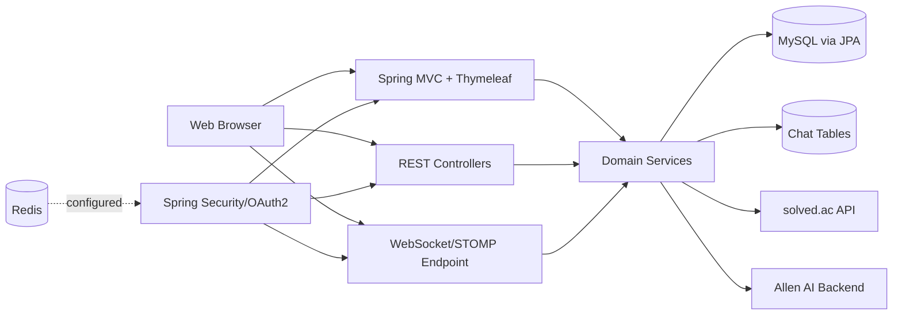

# 1. Executive Summary

이 저장소는 Java 17과 Spring Boot 3 기반의 알고리즘 학습용 웹 애플리케이션으로 보인다. 하나의 Spring Boot 애플리케이션 안에서 회원관리, 스터디 모집, 개인 플래너, 오답노트, 실시간 채팅, solved.ac/Allen 기반 문제 추천 기능을 함께 제공하는 구조다.

분석 결과 애플리케이션 유형은 "서버 렌더링 UI(Thymeleaf) + JSON API + WebSocket"을 함께 제공하는 모듈형 모놀리식 웹앱으로 판단된다. 핵심 영속 계층은 MySQL/JPA이며, Redis 설정이 존재하고 채팅에는 WebSocket/STOMP가 사용된다. 다만 Redis는 구성만 확인되고 실제 사용처는 코드 기준으로 명확하지 않다.

- 판단: Confirmed
- 관련 파일:
  - `README.md`
  - `build.gradle`
  - `src/main/java/com/example/algoyweb/AlgoyWebApplication.java`
  - `src/main/resources/application.yml`
- 근거 메모:
  - `build.gradle`에 Spring Web, Thymeleaf, Security, JPA, OAuth2, WebSocket, Redis 의존성이 선언되어 있다.
  - `AlgoyWebApplication.java`는 단일 Spring Boot 엔트리포인트와 스케줄링 활성화를 보여준다.
  - `application.yml`은 MySQL, OAuth2, 외부 AI 백엔드, Redis 설정을 포함한다.
- 왜 이 근거가 결론을 지지하는가:
  - 런타임, 프레임워크, 배포 대상, 저장소, 외부 연동 구성을 직접 보여주는 1차 증거이기 때문이다.

# 2. Project Overview

프로젝트 이름은 `algoy`이며, `/algoy/*` 하위 경로를 중심으로 기능이 구성되어 있다. UI 템플릿은 Thymeleaf로 제공되고, 정적 자산은 `src/main/resources/static` 아래에 있다. API와 화면 라우트가 동일 애플리케이션 안에 공존한다.

주요 기능 영역은 다음과 같다.

- 사용자: 회원가입, 로그인, 구글 OAuth2 로그인, 비밀번호 재설정, 마이페이지, 계정 복구, 관리자 페이지
- 스터디: 모집글 CRUD, 댓글/대댓글, 참여자 수 관리
- 플래너: 개인 일정/문제 풀이 계획 CRUD, 검색, 월별 조회
- 오답노트: 노트 CRUD, 코드 블록 CRUD
- 채팅: 채팅방 생성/초대/입장/퇴장, 메시지 조회, WebSocket 실시간 송수신
- 추천: solved.ac 사용자명 기반 문제 추천 결과 저장 및 홈 화면 표시

- 판단: Confirmed
- 관련 파일:
  - `src/main/java/com/example/algoyweb/controller`
  - `src/main/resources/templates`
  - `src/main/resources/static`
  - `README.md`
- 근거 메모:
  - 컨트롤러 패키지 구성이 기능 경계를 직접 드러낸다.
  - 템플릿 디렉터리 이름이 기능별 UI 표면을 보여준다.
  - README는 알고리즘 학습/추천/오답노트/플래너/스터디/채팅의 존재를 설명한다.
- 왜 이 근거가 결론을 지지하는가:
  - 라우트와 화면 파일은 실제 사용자 표면을 가장 직접적으로 보여준다.

# 3. Business Purpose Inferred From the Codebase

이 시스템의 사업 목적은 알고리즘 학습 사용자가 한 곳에서 학습 계획 수립, 스터디 참여, 오답 정리, 실시간 소통, 개인화 문제 추천을 수행하도록 지원하는 것으로 강하게 추론된다.

구체적으로는 다음 목적이 코드에서 드러난다.

- solved.ac 사용자명을 받아 추천 문제를 생성하고 홈 화면에 노출
- 스터디 모집글과 댓글 기반으로 스터디 참여 의사소통 지원
- 개인 플래너로 학습 일정과 문제 풀이 계획 관리
- 오답노트와 코드 블록으로 복습 지원
- 실시간 채팅으로 사용자 간 협업/대화 지원
- 관리자 페이지로 권한 승격, 밴, 밴 해제 운영

- 판단: Inferred
- 관련 파일:
  - `src/main/java/com/example/algoyweb/controller/HomeController.java`
  - `src/main/java/com/example/algoyweb/service/allen/AllenService.java`
  - `src/main/java/com/example/algoyweb/controller/study/StudyController.java`
  - `src/main/java/com/example/algoyweb/controller/planner/PlannerController.java`
  - `src/main/java/com/example/algoyweb/controller/WrongAnswerNote/WrongAnswerNoteRestController.java`
  - `src/main/java/com/example/algoyweb/controller/chatting/ChattingController.java`
- 근거 메모:
  - 홈 컨트롤러는 추천 문제를 모델에 주입한다.
  - Allen 서비스는 solved.ac 사용자명과 외부 AI API를 이용해 추천 문제를 저장한다.
  - 나머지 컨트롤러는 학습 관리 기능을 직접 제공한다.
- 왜 이 근거가 결론을 지지하는가:
  - 비즈니스 목적은 주로 사용자가 접근하는 기능 집합과 데이터 흐름의 합으로 드러나기 때문이다.

# 4. High-Level Architecture

애플리케이션은 단일 Spring Boot 프로세스 내에서 여러 기능 모듈이 공존하는 모듈형 모놀리식 구조다.

아키텍처 경계는 대체로 `controller -> service -> repository -> entity` 레이어를 따른다. 다만 예외적으로 일부 컨트롤러는 화면 반환과 API 반환을 함께 섞어 사용하고, `PlannerController`와 `WrongAnswerNote` 일부 엔드포인트는 `@PostAuthorize` 위주로 선언되어 있어 보안 의도와 실제 효과를 별도 검증할 필요가 있다.

- 판단: Confirmed
- 관련 파일:
  - `src/main/java/com/example/algoyweb/controller/*`
  - `src/main/java/com/example/algoyweb/service/*`
  - `src/main/java/com/example/algoyweb/repository/*`
  - `src/main/java/com/example/algoyweb/config/SecurityConfig.java`
  - `src/main/java/com/example/algoyweb/config/chatting/WebSocketConfig.java`
- 근거 메모:
  - 패키지 구조와 클래스 역할이 계층형 구조를 보여준다.
  - WebSocketConfig가 실시간 메시징 채널을 별도로 구성한다.
  - SecurityConfig가 인증/인가를 입구에서 통제한다.
- 왜 이 근거가 결론을 지지하는가:
  - 레이어 구조와 설정 클래스는 상위 아키텍처를 가장 명확하게 보여준다.

# 5. Runtime and Deployment Model

확인된 런타임 모델은 다음과 같다.

- 단일 JVM 프로세스로 Spring Boot 앱 구동
- 기본 포트는 `8081`
- MySQL 사용
- Redis 호스트는 `localhost:6379`로 설정
- Google OAuth2 클라이언트 필요
- 외부 AI 백엔드와 solved.ac API 호출
- GitHub Actions에서 빌드 후 EC2로 JAR 파일 SCP 전송 및 원격 실행

배포 파이프라인은 Docker 기반이 아니라 원격 EC2 인스턴스에서 JAR를 직접 실행하는 방식으로 확인된다. 프로세스 PID를 `/home/ubuntu/web-pid`에 기록하고, 이전 프로세스를 강제 종료한 뒤 `nohup java -jar ...`로 재기동한다.

- 판단: Confirmed
- 관련 파일:
  - `src/main/resources/application.yml`
  - `.github/workflows/gradle.yml`
  - `build.gradle`
- 근거 메모:
  - `application.yml`이 서버 포트와 데이터소스, Redis, OAuth 설정을 제공한다.
  - GitHub Actions 워크플로가 EC2 SSH/SCP 배포를 구현한다.
  - Dockerfile/compose 파일은 저장소에서 확인되지 않았다.
- 왜 이 근거가 결론을 지지하는가:
  - 실제 실행 인자와 CI/CD 스크립트는 운영 모델을 직접 보여준다.

# 6. Directory and Module Breakdown

주요 디렉터리는 다음과 같다.

- `src/main/java/com/example/algoyweb/config`: 보안, WebSocket, Redis 설정
- `src/main/java/com/example/algoyweb/controller`: HTTP/WebSocket 진입점
- `src/main/java/com/example/algoyweb/service`: 비즈니스 로직
- `src/main/java/com/example/algoyweb/repository`: JPA 저장소
- `src/main/java/com/example/algoyweb/model/entity`: JPA 엔티티
- `src/main/java/com/example/algoyweb/model/dto`: 요청/응답 DTO
- `src/main/java/com/example/algoyweb/util`: 변환기, 인증 성공 핸들러, 사용자 보조 유틸
- `src/main/resources/templates`: Thymeleaf 템플릿
- `src/main/resources/static`: CSS/JS/이미지
- `src/test/java`: 통합/단위 테스트

기능 모듈은 대체로 `user`, `study`, `planner`, `chatting`, `WrongAnswerNote`, `allen`, `auth`로 나뉜다.

- 판단: Confirmed
- 관련 파일:
  - `README.md`
  - `src/main/java/com/example/algoyweb/**`
  - `src/main/resources/**`
- 근거 메모:
  - 실제 패키지 및 리소스 구조가 기능별로 분리되어 있다.
- 왜 이 근거가 결론을 지지하는가:
  - 디렉터리 구조 자체가 모듈 경계와 유지보수 단위를 정의한다.

# 7. Request/Data Flow

## Flow A. 사용자 로그인 후 홈 추천문제 표시

- Trigger: 사용자가 폼 로그인 또는 OAuth2 로그인 성공
- Entrypoint: `SecurityConfig`, `UserAuthenticationSuccessHandler`, `HomeController`
- Key modules touched:
  - `config/SecurityConfig.java`
  - `util/user/UserAuthenticationSuccessHandler.java`
  - `service/allen/AllenService.java`
  - `service/user/UserService.java`
  - `controller/HomeController.java`
- Validations/auth checks:
  - Spring Security 인증 필수
  - 로그인 성공 핸들러에서 사용자의 solved.ac 사용자명 존재 여부 확인
- Persistence/external calls:
  - Allen AI 백엔드 호출
  - solved.ac 기반 추천 결과를 `SolvedACResponseEntity`로 저장
- Output/result:
  - 추천 문제 존재 시 `/algoy/home`에서 모델에 `problem`을 담아 렌더링

## Flow B. 스터디 모집글 작성 및 참여 흐름

- Trigger: 인증 사용자가 스터디 작성 또는 댓글 기반 참여 처리
- Entrypoint: `StudyController.createStudy`, `CommentController.joinComment`
- Key modules touched:
  - `controller/study/StudyController.java`
  - `service/study/StudyService.java`
  - `controller/study/CommentController.java`
  - `service/study/CommentService.java`
  - `repository/study/*`
- Validations/auth checks:
  - `@PreAuthorize`로 NORMAL/ADMIN만 허용
  - 수정 시 작성자와 현재 사용자 일치 여부 확인
  - 참여 처리 시 스터디 주인만 승인 가능하며 중복 참여 검사 수행
- Persistence/external calls:
  - `Study`, `Comment`, `Participant` 테이블 갱신
- Output/result:
  - 스터디 CRUD 응답 또는 참여자 등록 완료

## Flow C. 실시간 채팅 메시지 송수신

- Trigger: 클라이언트가 STOMP로 메시지 송신
- Entrypoint: `ChattingWebSocketController.sendMessage`
- Key modules touched:
  - `config/chatting/WebSocketConfig.java`
  - `controller/chatting/ChattingWebSocketController.java`
  - `service/chatting/ChattingService.java`
  - `repository/chatting/*`
- Validations/auth checks:
  - WebSocket 엔드포인트는 인증 필요
  - 서비스에서 메시지 길이 제한, 참여자 여부 확인
- Persistence/external calls:
  - 채팅 메시지를 DB에 저장
  - `SimpMessagingTemplate`로 `/topic/room/{roomId}` 방송
- Output/result:
  - 채팅방 구독자 전원에게 실시간 메시지 전달

- 판단: Confirmed
- 관련 파일:
  - `src/main/java/com/example/algoyweb/util/user/UserAuthenticationSuccessHandler.java`
  - `src/main/java/com/example/algoyweb/controller/HomeController.java`
  - `src/main/java/com/example/algoyweb/controller/study/StudyController.java`
  - `src/main/java/com/example/algoyweb/controller/study/CommentController.java`
  - `src/main/java/com/example/algoyweb/controller/chatting/ChattingWebSocketController.java`
  - `src/main/java/com/example/algoyweb/service/chatting/ChattingService.java`
- 근거 메모:
  - 각 흐름의 시작점과 저장/전송 처리가 코드에 명시되어 있다.
- 왜 이 근거가 결론을 지지하는가:
  - 요청-서비스-저장-응답 연결이 실제 메서드 체인으로 확인된다.

# 8. Core Domain Model

핵심 도메인 모델은 `User` 중심 구조다.

- `User`: 계정, 역할, 탈퇴 여부, 밴 정보, solved.ac 사용자명 보유
- `Planner`: 사용자 소유 일정/문제 계획
- `Study`: 사용자 소유 스터디 모집글
- `Comment`: 스터디 댓글/대댓글
- `Participant`: 스터디 참여자 매핑
- `WrongAnswerNote`: 사용자 소유 오답노트
- `Code`: 오답노트에 종속된 코드 블록
- `ChattingRoom`: 방장과 참가자 ID 목록을 가진 채팅방
- `Chatting`: 채팅 메시지
- `SolvedACResponseEntity`: 사용자별 추천 문제 결과 저장소

관계 요약:

- `User` 1:N `Planner`, `Study`, `Comment`, `WrongAnswerNote`
- `User` 1:1 `SolvedACResponseEntity`
- `Study` 1:N `Comment`, `Participant`
- `WrongAnswerNote` 1:N `Code`
- `ChattingRoom`은 참가자 ID를 `@ElementCollection`으로 관리

- 판단: Confirmed
- 관련 파일:
  - `src/main/java/com/example/algoyweb/model/entity/user/User.java`
  - `src/main/java/com/example/algoyweb/model/entity/planner/Planner.java`
  - `src/main/java/com/example/algoyweb/model/entity/study/Study.java`
  - `src/main/java/com/example/algoyweb/model/entity/study/Comment.java`
  - `src/main/java/com/example/algoyweb/model/entity/study/Participant.java`
  - `src/main/java/com/example/algoyweb/model/entity/WrongAnswerNote/WrongAnswerNote.java`
  - `src/main/java/com/example/algoyweb/model/entity/WrongAnswerNote/Code.java`
  - `src/main/java/com/example/algoyweb/model/entity/chatting/ChattingRoom.java`
  - `src/main/java/com/example/algoyweb/model/entity/chatting/Chatting.java`
  - `src/main/java/com/example/algoyweb/model/entity/allen/SolvedACResponseEntity.java`
- 근거 메모:
  - JPA 연관관계와 필드가 도메인 모델을 직접 정의한다.
- 왜 이 근거가 결론을 지지하는가:
  - 엔티티는 시스템의 저장 가능한 핵심 개념을 가장 정확히 표현한다.

# 9. External Dependencies and Integrations

확인된 외부 의존성과 연동은 다음과 같다.

- Google OAuth2 로그인
- solved.ac API
- Allen AI 백엔드 (`askallen.url`)
- MySQL
- Redis
- GitHub Actions
- EC2 SSH/SCP 배포

강하게 추론되지만 불명확한 부분:

- README에는 MongoDB 배지가 있으나 현재 코드와 `build.gradle` 기준 MongoDB 드라이버/리포지토리는 확인되지 않았다.

- 판단: Confirmed + Inferred
- 관련 파일:
  - `build.gradle`
  - `src/main/resources/application.yml`
  - `src/main/java/com/example/algoyweb/service/allen/AllenService.java`
  - `src/main/java/com/example/algoyweb/service/auth/CustomOAuth2UserService.java`
  - `.github/workflows/gradle.yml`
  - `README.md`
- 근거 메모:
  - 의존성 선언, 설정값, 연동 서비스 코드가 존재한다.
  - README의 기술 스택 표와 현재 코드 사이에 일부 불일치가 있다.
- 왜 이 근거가 결론을 지지하는가:
  - 실제 코드와 설정이 현재 연동 상태를, README는 과거 또는 홍보용 진술을 보여준다.

# 10. Configuration and Environment Variables

확인된 주요 설정값:

- `server.port=8081`
- `AI_BACKEND_URL`
- `DATASOURCE_URL`
- `DATASOURCE_USERNAME`
- `DATASOURCE_PASSWORD`
- `GOOGLE_CLIENT_ID`
- `GOOGLE_CLIENT_SECRET`
- `GOOGLE_REDIRECT_URI`
- `solvedac.url`
- `askallen.url`
- `spring.data.redis.host`
- `spring.data.redis.port`

테스트 설정에서는 H2 인메모리 DB와 테스트용 OAuth2 값을 사용한다.

- 판단: Confirmed
- 관련 파일:
  - `src/main/resources/application.yml`
  - `src/test/resources/application.yml`
  - `.github/workflows/gradle.yml`
- 근거 메모:
  - 운영/테스트 환경 구성이 분리되어 있다.
  - GitHub Actions가 일부 환경변수를 비밀값으로 주입한다.
- 왜 이 근거가 결론을 지지하는가:
  - 설정 파일과 CI 변수 주입 구문이 운영 계약을 직접 보여준다.

# 11. Database and Persistence Layer

주 영속 계층은 Spring Data JPA + MySQL이다. 테스트에서는 H2를 사용한다. 마이그레이션 도구(Flyway/Liquibase)나 SQL 스키마 파일은 확인되지 않았다.

저장 패턴은 다음과 같다.

- JPA 엔티티 기반 매핑
- `JpaRepository` 중심 저장소
- 일부 JPQL `@Query` 사용
- 채팅 메시지와 채팅방도 동일한 관계형 DB에 저장

불명확한 점:

- 스키마 생성 책임이 애플리케이션 외부에 있는지, 수동 DDL인지 저장소만으로는 확인되지 않는다.
- `ddl-auto: none`이므로 운영 스키마는 별도 준비가 필요하다.

- 판단: Confirmed + Unclear
- 관련 파일:
  - `build.gradle`
  - `src/main/resources/application.yml`
  - `src/test/resources/application.yml`
  - `src/main/java/com/example/algoyweb/repository/**`
  - `src/main/java/com/example/algoyweb/model/entity/**`
- 근거 메모:
  - JPA와 MySQL 드라이버가 선언되어 있고, 운영에서는 `ddl-auto: none`이다.
  - 마이그레이션 파일은 저장소에서 발견되지 않았다.
- 왜 이 근거가 결론을 지지하는가:
  - 실제 저장 기술은 설정과 엔티티/리포지토리 조합으로 확인 가능하다.

# 12. Authentication and Authorization

인증은 Spring Security 폼 로그인과 Google OAuth2 로그인을 병행한다. 권한은 `ROLE_ADMIN`, `ROLE_NORMAL`, `ROLE_BANNED`가 존재한다.

인가 특징:

- 공개 경로: 홈, 로그인, 회원가입, 일부 중복확인/비밀번호 재설정, Allen 관련 일부 경로
- 대부분의 기능은 인증 필요
- 스터디/채팅/마이페이지/관리자 기능은 역할 기반 제어
- WebSocket 엔드포인트 `/algoy/chat-websocket`는 인증 요구
- remember-me 사용

주의점:

- 일부 컨트롤러가 `@PostAuthorize`를 사용하고 있어, 의도한 사전 차단이 충분한지 검토가 필요하다.
- `WrongAnswerNote`의 `CodeController`에는 사용자 소유권 검증이 직접 보이지 않는다.

- 판단: Confirmed + Inferred
- 관련 파일:
  - `src/main/java/com/example/algoyweb/config/SecurityConfig.java`
  - `src/main/java/com/example/algoyweb/model/entity/user/Role.java`
  - `src/main/java/com/example/algoyweb/service/auth/CustomOAuth2UserService.java`
  - `src/main/java/com/example/algoyweb/controller/user/AdminController.java`
  - `src/main/java/com/example/algoyweb/controller/WrongAnswerNote/CodeController.java`
- 근거 메모:
  - SecurityFilterChain과 메서드 보안 애노테이션이 인가 정책을 정의한다.
  - OAuth2 서비스가 세션 사용자 저장을 수행한다.
- 왜 이 근거가 결론을 지지하는가:
  - 인증/인가 정책은 설정 클래스와 애노테이션에 직접 구현되어 있다.

# 13. Background Jobs / Queues / Schedulers

메시지 큐나 별도 워커 프로세스는 확인되지 않았다. 대신 애플리케이션 내부 스케줄러가 존재한다.

- 탈퇴 계정 영구 삭제 스케줄러
- 밴 만료 사용자 자동 복구 스케줄러

비동기성은 다음 정도로 확인된다.

- WebSocket 실시간 브로드캐스트
- 로그인 성공 시 외부 추천 API 호출

- 판단: Confirmed
- 관련 파일:
  - `src/main/java/com/example/algoyweb/AlgoyWebApplication.java`
  - `src/main/java/com/example/algoyweb/service/user/UserService.java`
  - `src/main/java/com/example/algoyweb/service/user/UserPermissionService.java`
- 근거 메모:
  - `@EnableScheduling`과 `@Scheduled` 메서드가 존재한다.
- 왜 이 근거가 결론을 지지하는가:
  - 애플리케이션 내부 주기 작업 여부를 직접 보여준다.

# 14. API Surface / UI Surface

확인된 표면은 크게 세 가지다.

- 서버 렌더링 UI:
  - 홈, 로그인, 회원가입, 비밀번호 찾기/재설정, 플래너 화면, 스터디 화면, 오답노트 화면, 마이페이지, 관리자 페이지
- REST API:
  - `/algoy/study/*`
  - `/algoy/comment/*`
  - `/algoy/planner/*`
  - `/algoy/api/chat/*`
  - `/api/algoy/commit/*`
  - `/api/codes/*`
  - `/algoy/allen/solvedac`
- WebSocket/STOMP:
  - handshake: `/algoy/chat-websocket`
  - broker topic: `/topic/room/{roomId}`
  - app destination: `/algoy/**`

- 판단: Confirmed
- 관련 파일:
  - `src/main/java/com/example/algoyweb/controller/**`
  - `src/main/java/com/example/algoyweb/config/chatting/WebSocketConfig.java`
  - `src/main/resources/templates/**`
- 근거 메모:
  - 컨트롤러 매핑과 템플릿 파일명이 실제 표면을 나타낸다.
- 왜 이 근거가 결론을 지지하는가:
  - 입출력 표면은 라우팅 선언과 템플릿 존재 여부로 직접 확인 가능하다.

# 15. Build, Test, and Local Run Instructions

코드 기준으로 확인 가능한 로컬 실행 절차는 다음과 같다.

1. Java 17과 Gradle Wrapper 사용
2. 필수 환경변수 준비
   - `AI_BACKEND_URL`
   - `DATASOURCE_URL`
   - `DATASOURCE_USERNAME`
   - `DATASOURCE_PASSWORD`
   - `GOOGLE_CLIENT_ID`
   - `GOOGLE_CLIENT_SECRET`
   - `GOOGLE_REDIRECT_URI`
3. MySQL 및 필요 시 Redis 실행
4. 실행:
   - `./gradlew bootRun` 또는 `./gradlew build` 후 JAR 실행
5. 테스트:
   - `./gradlew test`

주의:

- 테스트는 H2로 동작하도록 별도 설정되어 있다.
- 운영 설정은 `ddl-auto: none`이라 스키마가 사전에 준비되어 있어야 한다.
- 본 분석 과정에서는 실제 빌드/테스트를 수행하지 못했다.

- 판단: Confirmed + Unclear
- 관련 파일:
  - `build.gradle`
  - `src/main/resources/application.yml`
  - `src/test/resources/application.yml`
  - `.github/workflows/gradle.yml`
  - `gradlew`
  - `gradlew.bat`
- 근거 메모:
  - 빌드 도구와 테스트 프레임워크는 코드에서 확인된다.
  - 실제 운영용 DB 스키마 준비 절차는 문서화되어 있지 않다.
- 왜 이 근거가 결론을 지지하는가:
  - 로컬 실행에 필요한 런타임 계약은 설정/빌드 파일로 확인 가능하지만, 외부 인프라 준비 절차는 일부 불명확하다.

# 16. Observed Design Patterns and Conventions

관찰된 패턴과 관례는 다음과 같다.

- 전형적인 Spring 계층형 구조
- DTO와 Entity를 분리하고 `ConvertUtils`, 기능별 convert util 사용
- 기능별 패키지 분리
- Thymeleaf 템플릿 + 정적 JS/CSS 조합
- 예외 코드 enum과 커스텀 예외 사용
- 통합 테스트와 단위 테스트 혼합

일관성이 약한 부분도 있다.

- 컨트롤러에 REST와 뷰 반환이 혼재
- 인증/인가 애노테이션 사용 방식이 `@PreAuthorize`와 `@PostAuthorize`로 혼합
- 인코딩/주석/문자셋 불일치 흔적이 있음
- 일부 네이밍이 일관되지 않음 (`WrongAnswerNote`, `allen`, `algoy/api/chat` 등)

- 판단: Confirmed
- 관련 파일:
  - `src/main/java/com/example/algoyweb/util/ConvertUtils.java`
  - `src/main/java/com/example/algoyweb/util/WrongAnswerNote/WrongAnswerNoteConvertUtil.java`
  - `src/main/java/com/example/algoyweb/exception/**`
  - `src/test/java/**`
- 근거 메모:
  - 구조와 유틸, 테스트, 예외 계층에서 반복 패턴이 보인다.
- 왜 이 근거가 결론을 지지하는가:
  - 설계 패턴은 반복되는 구현 습관에서 드러난다.

# 17. Risks, Technical Debt, and Unknowns

- `CodeController`는 코드 블록 CRUD에 대해 소유권/인증 검증이 보이지 않는다. 오답노트 본문은 사용자별 보호가 있으나 코드 블록 API는 별도 검증이 없어 보안 위험이 있다.
- `PlannerRepository.findByMonth`는 사용자 필터 없이 월별 계획을 조회한다. 컨트롤러도 현재 사용자 기준 필터를 추가하지 않아 다른 사용자의 일정이 섞일 가능성이 있다.
- `PlannerController`와 `WrongAnswerNote` 일부 메서드는 `@PostAuthorize`를 사용한다. 의도한 접근 차단이 아니라 응답 후 검사 성격이므로 정책 검증이 필요하다.
- `UserService.findPassword/resetPassword`는 비밀번호 필드에 임시 토큰을 저장하는 방식이라 설계상 취약할 수 있다.
- README에는 MongoDB, Docker 등 기술이 보이지만 현재 코드/설정과 완전히 일치하지 않는다.
- 마이그레이션 도구나 운영 스키마 문서가 없어 신규 환경 구축 리스크가 있다.
- Redis는 설정만 확인되며 실제 비즈니스 사용처는 불명확하다.
- `AI_BACKEND_URL`과 `askallen.url`이 동시에 존재하는데 각 용도가 완전히 문서화되어 있지 않다.
- `.github/workflows/gradle.yml`은 JAR 이름을 고정 문자열로 기대하는데, 실제 빌드 산출물 이름과 불일치 가능성이 있다.
- 컨트롤러/주석 일부에 깨진 한글이 보여 저장소 인코딩 관리 문제가 의심된다.

- 판단: Confirmed + Inferred + Unclear
- 관련 파일:
  - `src/main/java/com/example/algoyweb/controller/WrongAnswerNote/CodeController.java`
  - `src/main/java/com/example/algoyweb/repository/planner/PlannerRepository.java`
  - `src/main/java/com/example/algoyweb/controller/planner/PlannerController.java`
  - `src/main/java/com/example/algoyweb/service/user/UserService.java`
  - `.github/workflows/gradle.yml`
  - `README.md`
- 근거 메모:
  - 보안/데이터 격리/배포 스크립트의 잠재 문제는 코드 구조상 직접 관찰된다.
- 왜 이 근거가 결론을 지지하는가:
  - 위험 요소는 현재 구현과 기대 동작의 차이, 또는 문서 부재에서 주로 발생한다.

# 18. Glossary

- Algoy: 애플리케이션 이름
- Allen: 외부 AI 추천 백엔드로 보이는 서비스
- solved.ac: 알고리즘 문제 풀이 사용자 정보/문제 관련 외부 서비스
- Planner: 개인 일정 및 문제 풀이 계획
- Study: 스터디 모집 게시글
- Comment: 스터디 댓글 및 대댓글
- Participant: 스터디 참여자 매핑 엔티티
- WrongAnswerNote: 오답노트
- Code: 오답노트 하위 코드 블록
- ChattingRoom: 채팅방
- Chatting: 채팅 메시지
- Role.NORMAL: 일반 사용자
- Role.ADMIN: 관리자
- Role.BANNED: 이용 제한 사용자

- 판단: Confirmed
- 관련 파일:
  - `src/main/java/com/example/algoyweb/model/entity/**`
  - `src/main/java/com/example/algoyweb/model/dto/**`
  - `README.md`
- 근거 메모:
  - 클래스명과 enum 명칭이 용어집의 직접 출처다.
- 왜 이 근거가 결론을 지지하는가:
  - 시스템 용어는 도메인 클래스 이름과 역할 정의에서 가장 명확히 드러난다.

# 19. Evidence Appendix

- Claim: 이 프로젝트는 단일 Spring Boot 애플리케이션으로 동작한다.
- Confidence: Confirmed
- Evidence:
  - `src/main/java/com/example/algoyweb/AlgoyWebApplication.java`
  - `build.gradle`
- Notes:
  - 단일 `@SpringBootApplication` 엔트리포인트가 확인된다.

- Claim: 서버 렌더링 UI와 REST API가 같은 코드베이스에 공존한다.
- Confidence: Confirmed
- Evidence:
  - `src/main/resources/templates/home.html`
  - `src/main/java/com/example/algoyweb/controller/HomeController.java`
  - `src/main/java/com/example/algoyweb/controller/study/StudyController.java`
- Notes:
  - Thymeleaf 뷰 반환과 JSON `ResponseEntity` 반환이 모두 존재한다.

- Claim: 주요 영속 계층은 MySQL + JPA이며 테스트는 H2를 사용한다.
- Confidence: Confirmed
- Evidence:
  - `build.gradle`
  - `src/main/resources/application.yml`
  - `src/test/resources/application.yml`
- Notes:
  - 운영은 MySQL 드라이버, 테스트는 H2 드라이버가 선언되어 있다.

- Claim: 채팅은 WebSocket/STOMP 기반 실시간 메시징을 사용한다.
- Confidence: Confirmed
- Evidence:
  - `src/main/java/com/example/algoyweb/config/chatting/WebSocketConfig.java`
  - `src/main/java/com/example/algoyweb/controller/chatting/ChattingWebSocketController.java`
  - `src/main/java/com/example/algoyweb/service/chatting/ChattingService.java`
- Notes:
  - STOMP 엔드포인트, 토픽 브로드캐스트, 메시지 저장 흐름이 구현돼 있다.

- Claim: 로그인 성공 시 추천 문제를 외부 AI 백엔드에서 받아 저장하려는 흐름이 존재한다.
- Confidence: Confirmed
- Evidence:
  - `src/main/java/com/example/algoyweb/util/user/UserAuthenticationSuccessHandler.java`
  - `src/main/java/com/example/algoyweb/service/allen/AllenService.java`
  - `src/main/java/com/example/algoyweb/repository/allen/SolvedACResponseRepository.java`
- Notes:
  - 로그인 성공 핸들러가 Allen 서비스를 호출하고 추천 결과 저장 서비스가 존재한다.

- Claim: 관리자 기능은 사용자 권한 승격, 밴, 밴 해제를 포함한다.
- Confidence: Confirmed
- Evidence:
  - `src/main/java/com/example/algoyweb/controller/user/AdminController.java`
  - `src/main/java/com/example/algoyweb/service/user/UserPermissionService.java`
- Notes:
  - 관리자 페이지와 역할 제어 메서드가 확인된다.

- Claim: 탈퇴 계정 정리와 밴 해제는 스케줄러로 처리된다.
- Confidence: Confirmed
- Evidence:
  - `src/main/java/com/example/algoyweb/AlgoyWebApplication.java`
  - `src/main/java/com/example/algoyweb/service/user/UserService.java`
  - `src/main/java/com/example/algoyweb/service/user/UserPermissionService.java`
- Notes:
  - `@EnableScheduling`, `@Scheduled` 메서드가 존재한다.

- Claim: Redis는 설정되어 있지만 실제 비즈니스 사용은 불명확하다.
- Confidence: Unclear
- Evidence:
  - `src/main/resources/application.yml`
  - `src/main/java/com/example/algoyweb/config/redis/RedisConfig.java`
- Notes:
  - 연결 설정과 `RedisTemplate`은 있으나 이를 사용하는 서비스 호출은 분석 범위에서 명확히 확인되지 않았다.

- Claim: 월별 플래너 조회가 사용자별 격리를 보장하는지는 의심스럽다.
- Confidence: Inferred
- Evidence:
  - `src/main/java/com/example/algoyweb/controller/planner/PlannerController.java`
  - `src/main/java/com/example/algoyweb/service/planner/PlannerService.java`
  - `src/main/java/com/example/algoyweb/repository/planner/PlannerRepository.java`
- Notes:
  - 월 조회 쿼리에 사용자 조건이 없다.

- Claim: 코드 블록 API는 오답노트 소유권 검증이 부족할 가능성이 있다.
- Confidence: Inferred
- Evidence:
  - `src/main/java/com/example/algoyweb/controller/WrongAnswerNote/CodeController.java`
  - `src/main/java/com/example/algoyweb/service/WrongAnswerNote/CodeService.java`
- Notes:
  - 인증/인가 또는 현재 사용자 검증 코드가 직접 보이지 않는다.

- Claim: 배포는 GitHub Actions에서 EC2에 JAR를 복사해 직접 실행하는 방식이다.
- Confidence: Confirmed
- Evidence:
  - `.github/workflows/gradle.yml`
- Notes:
  - SSH 키 설정, SCP, 원격 `java -jar` 실행 단계가 존재한다.

- Claim: README의 기술 스택 설명이 현재 코드와 일부 다를 수 있다.
- Confidence: Inferred
- Evidence:
  - `README.md`
  - `build.gradle`
- Notes:
  - README에는 MongoDB와 Docker가 언급되지만 현재 의존성/배포 구현과 일치하지 않는다.
